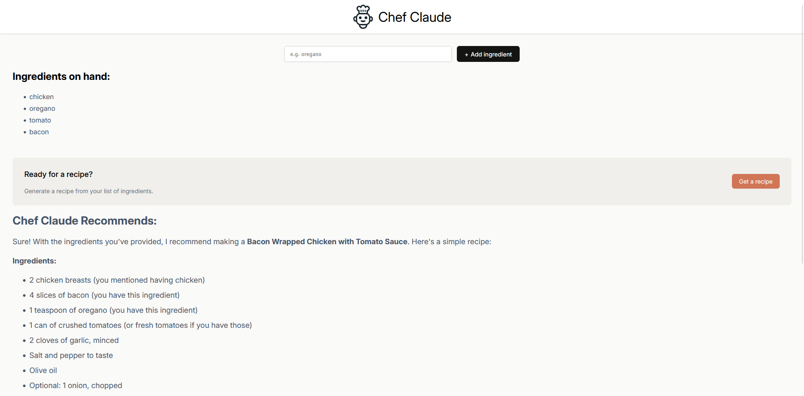

# Chef Claude 🧑‍🍳✨

[](https://react.dev/)
[](https://vitejs.dev/)
[]()

An intelligent recipe generator built with **React** and **Vite**, using the **Hugging Face Inference API**.  
Based on the user's provided ingredients, it generates a personalized recipe formatted in Markdown!

## 🚀 Technologies Used
- [React](https://react.dev/)
- [Vite](https://vitejs.dev/)
- [Hugging Face Inference API](https://huggingface.co/inference-api)
- JavaScript (ES6+)
- HTML5 & CSS3

## 🎯 Features
- ➕ Add ingredients manually.
- 🍲 Generate recipes based on selected ingredients.
- 🧹 Clean, responsive, and modern interface.
- 📄 Output formatted in **Markdown** for better presentation.
- 🔐 Secure API key management using environment variables.

## 📸 Screenshot


## ⚙️ How to Run Locally
```bash
git clone https://github.com/GuilhermeSilvaDev/chef-claude.git
cd chef-claude
npm install
# Create a .env file with your Hugging Face token
# VITE_HF_ACCESS_TOKEN=your_huggingface_token
npm run dev

⚠️ Security Notes

🚨 Never share your .env file or your API keys!
This project already includes a .gitignore to protect sensitive environment variables.
For public deployments (Netlify, Vercel, etc.), it is recommended to use a backend server to protect your keys.
📚 What I Learned From This Project

    Building functional React components.

    Managing state (useState) and handling form events.

    Integrating external APIs (Hugging Face Inference).

    Configuring environment variables in Vite (import.meta.env).

    Applying security best practices in React projects.

📄 License

Project created as part of the React Course at Scrimba.
Free to use for educational and personal purposes.
👨‍💻 Author

Guilherme Silva
GitHub